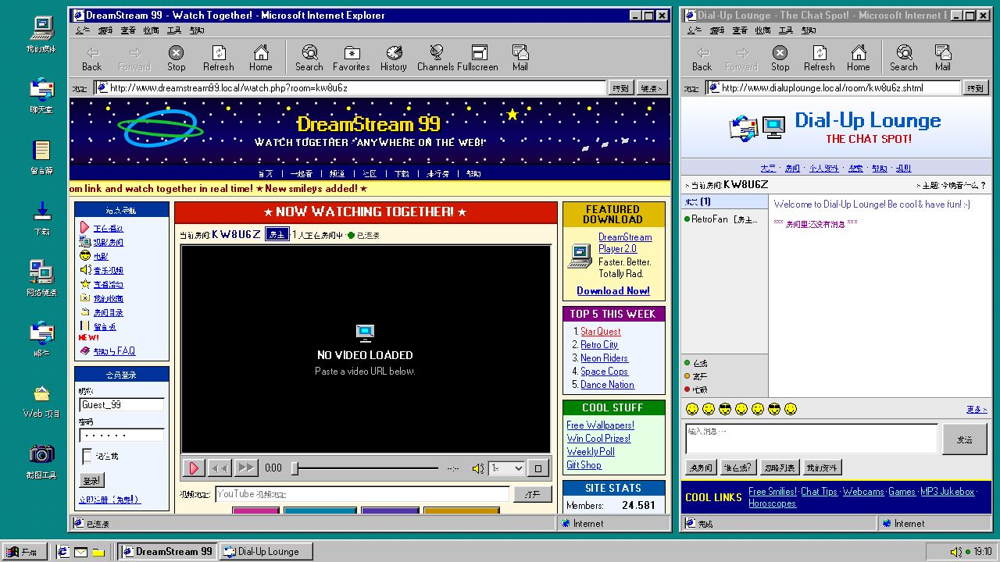

# DreamStream 99

Windows 98 视觉风格的 YouTube 同步观影与实时聊天应用。



## 功能

- 同步加载、播放、暂停、跳转与倍速状态
- GitHub Pages 中可直接体验的模拟聊天与在线成员列表
- 房主 / 访客令牌及独立的播放、聊天权限
- 可拖动、缩放、最小化和最大化的桌面窗口
- 清晰的系统 UI 字体、复古展示字体、可替换素材与高 DPI 整数倍缩放
- GitHub Pages 静态演示模式

## Serverless 架构

- GitHub Pages：Win98 UI、YouTube 播放器与截图工具
- Cloudflare Worker（下一阶段）：创建房间、Token 校验与 WebSocket Upgrade
- Durable Object（下一阶段）：每个房间的播放状态、成员、聊天与广播
- 原生 HTML、CSS、JavaScript；构建与测试使用 Node.js

线上演示：<https://bothervast.github.io/DreamStream99/>

不需要常驻 Node 服务、Redis、传统数据库或运维 VPS。仓库中的 Express / Socket.IO 服务仅作为已有同步原型保留，不是 Pages 部署依赖。

## 快速开始

需要 Node.js 20 或更高版本。

```bash
npm ci
npm start
```

打开 <http://localhost:3000>。页面会自动创建房间；输入昵称连接后，即可载入 YouTube 链接并通过“邀请朋友”复制访客链接。

开发模式：

```bash
npm run dev
```

使用其他端口：

```bash
PORT=3001 npm start
```

## 配置

| 文件 | 用途 |
| --- | --- |
| [`public/config.js`](public/config.js) | 文案、主题、窗口、桌面图标与默认素材 |
| [`public/assets-config.js`](public/assets-config.js) | 快速覆盖 Logo、背景和图标 |
| [`public/runtime-config.js`](public/runtime-config.js) | 后端地址与运行模式 |
| [`ASSET_GUIDE.md`](ASSET_GUIDE.md) | 自定义素材说明 |

自定义图片建议放在 `public/assets/custom/`。如需清除浏览器中保存的窗口和图标位置，可访问：

```text
http://localhost:3000/?resetLayout=1
```

UI 通过 `RoomClient` 与房间传输解耦：`DemoRoomClient` 用于 Pages 静态展示，`WebSocketRoomClient` 预留给 Worker + Durable Object。核心接口包括 `join()`、`sendPlayback()`、`sendChat()` 和 `onSnapshot()`。

### 字体

功能性 UI 与正文使用 13px 系统字体栈，确保普通 1× 屏幕上的中英文清晰可读。Pixelated MS Sans Serif、可选的“方正像素12”和文泉驿点阵宋体只用于 Logo、大标题等复古展示文字。

项目不分发方正字体文件。如已取得相应的 Web 嵌入授权，可把字体放入 `public/assets/fonts/`，再设置 `public/config.js`：

```js
fonts: {
  preferredCjkUrl: '/assets/fonts/your-licensed-fz-pixel-12.ttf',
}
```

页面与静态资源统一使用 UTF-8；多级中文回退用于避免缺字方框和编码乱码。

## 可用命令

| 命令 | 说明 |
| --- | --- |
| `npm start` | 启动应用服务 |
| `npm run dev` | 监听文件变化并自动重启 |
| `npm run build` | 生成 `dist/` 静态站点 |
| `npm test` | 运行测试 |
| `npm run check` | 检查 JavaScript 语法 |
| `npm run verify` | 运行语法检查与测试 |

## 部署说明

`npm run build` 生成完全静态的 GitHub Pages 演示版，不提供跨设备同步；推送到 `main` 后，仓库内的 GitHub Actions 工作流会自动校验、构建并部署 `dist/`。构建过程会自动把资源路径改写为适用于项目子路径的相对 URL，并强制使用 `demo` 运行模式。

本地保留的 Node 同步原型仍可用于联调；正式多人同步将由 Cloudflare Worker + Durable Object 接管。

## 许可

项目代码采用 [MIT License](LICENSE)。字体与图像素材的来源及许可见 [THIRD_PARTY_NOTICES.md](THIRD_PARTY_NOTICES.md)。
